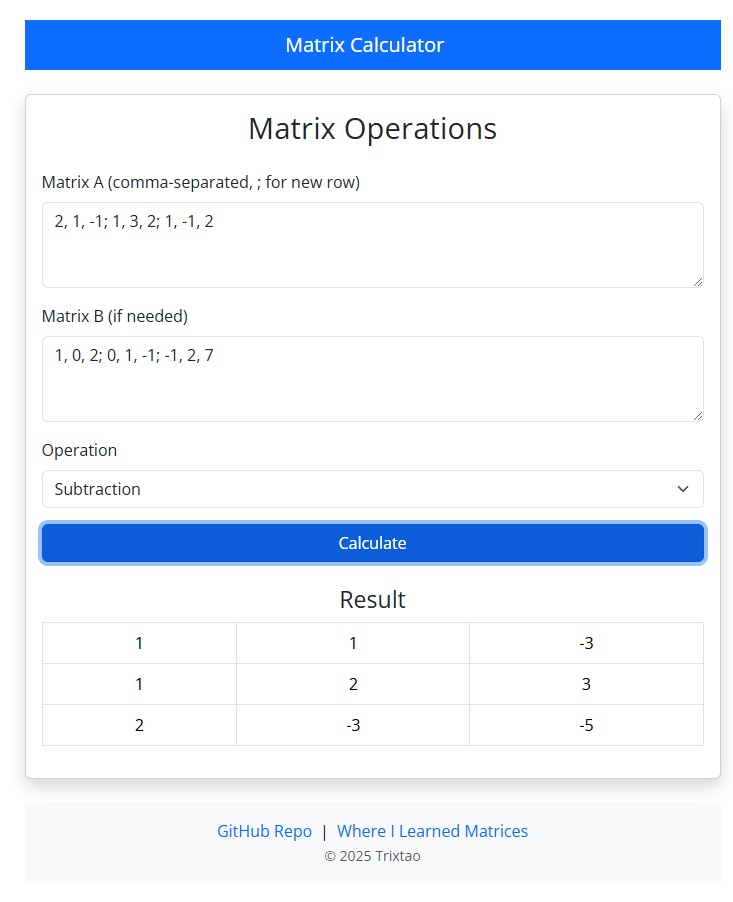

# Trix's Matrix Calculator

A full-stack Matrix Calculator web application with a React frontend and a Django backend that supports various matrix operations such as addition, subtraction, scalar multiplication, Gaussian elimination, and Gauss-Jordan elimination. 

On a personal note: This is my first ever personal project, and this was inspired by one of my friends who had this amazing submission for their  CSCI 40 midterm project. I used that as inspiration to create this, also to help with my reviewing for my Discrete Math modules. One of my friends also made this [sick code about Gaussian elimination](https://github.com/XIAOISTALL123/gaussianElim/blob/master/gaussian.py) which you should check out. 

## Table of Contents

- [How to Use](#how-to-use)
- [Screenshots](#screenshots)

## How To Use
1. **Enter Matrix Values:**  
   In the Matrix Calculator UI, input Matrix A and Matrix B values as comma-separated values, with each row separated by a semicolon (e.g., `2,1,-1;1,3,2;1,-1,2`). It supports whitespace too actually, just make sure to follow what I said.

2. **Select Operation:**  
   Choose the matrix operation you want to perform (Addition, Subtraction, Scalar Multiplication, Gaussian Elimination, or Gauss-Jordan Elimination).

3. **Calculate:**  
   Click the **Calculate** button to send the request to the backend. The resulting matrix will be displayed in a formatted table.

4. **Error Handling:**  
   If an operation cannot be performed, the table will display "undefined" in place of a value.

## Screenshots

Below are some screenshots of the application in action:

### Matrix Operation Example

